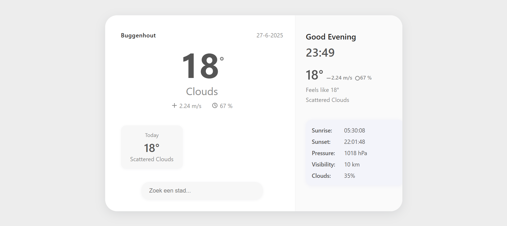

# Weather App

This Progressive Web App displays the current weather for a given city. Built with React and the OpenWeatherMap API.

## Features

- Search weather by city
- Display temperature, wind, humidity, description, sunrise/sunset, pressure, visibility, and cloudiness
- Responsive design
- Live time and greeting

## Installation

1. Clone this repository:

   ```sh
   git clone https://github.com/PieterLuypaert/weather-app.git
   cd weather-app
   ```

2. Install the dependencies:

   ```sh
   npm install
   ```

3. Start the development server:

   ```sh
   npm start
   ```

4. Open [http://localhost:3000](http://localhost:3000) in your browser.

## Preview



Developed by Pieter